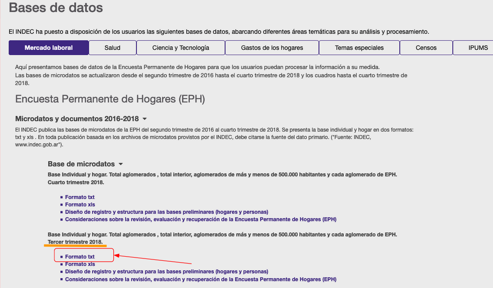

## Introduccion

El [INDEC](https://www.indec.gob.ar) libera cada trimestre la base de datos de la `Encuesta Permanente de Hogares`, o `EPH`, la misma es una encuesta que se hace en hogares de todo el pais y nos permite analizar estadisticamente a la poblacion de nuestro pais. Desafortunadamente las encuestas realizadas entre 2007 y 2015 tienen muchos problemas metodologicos [segun nos indican desde la pagina del INDEC](https://www.indec.gob.ar/ftp/cuadros/sociedad/anexo_informe_eph_23_08_16.pdf), pero tenemos [datos detallados desde 2016-2do trimestre en adelante](https://www.indec.gob.ar/bases-de-datos.asp).

Descargue los datos del tercer trimestre de 2018 (Es decir, Jul-Sep 2018):


Recordar poner el txt en el mismo directorio de trabajo.

Luego cree un script en R para procesar los datos, investigando la fuente de datos vi que habia varios mappings que vienen de PDFs, la base de datos requiere bastante "masajeo" para analizar, cree en base a los PDFs archivos CSV con los codigos de ocupaciones, y los codigos de actividad del mercosur. [Ambos archivos csv estan disponibles en el repositorio de este proyecto: https://github.com/sicarul/eph-salarios](https://github.com/sicarul/eph-salarios).

Algo importante a tener en cuenta es que el ritmo de la inflacion desde que estos datos fueron capturados hace necesario leer los datos en forma relativa y no absoluta.

```{r Cargar y transformar, message=FALSE, warning=FALSE, include=FALSE, paged.print=FALSE}

knitr::opts_chunk$set(echo=FALSE)

library(tidyverse)
library(Hmisc)
library(funModeling)
library(ggforce)
summarize = dplyr::summarise

individual = read_delim('usu_individual_T318.txt', delim = ';')

mercosur_codes=read_csv('mercosur_codes.csv')
caracter_ocupacional_codes=read_csv('caracter_ocupacional.csv')

simple_boolean = function(x) {
  case_when(
      x==1 ~ TRUE,
      x==2 ~ FALSE,
      TRUE ~ NA
      )
}

individual_transf = select(individual,
                           entrevista=H15,
                           trimestre=TRIMESTRE,
                           region=REGION,
                           aglomerado=AGLOMERADO,
                           sexo=CH04,
                           edad=CH06,
                           sistema_salud=CH08,
                           alfabeto=CH09,
                           asistio_escuela=CH10,
                           tipo_escuela=CH11,
                           nivel_educacion=CH12,
                           finalizo_educacion=CH13,
                           ultimoanyo=CH14,
                           nacimiento=CH15,
                           nivel_educativo=NIVEL_ED,
                           tipo_actividad=CAT_OCUP,
                           tipo_inactividad=CAT_INAC,
                           imputados=IMPUTA,
                           estado_actividad=ESTADO,
                           estado_civil=CH07,
                           trabajo_12m=PP02I,
                           trabajo_busco_12m=PP02H,
                           trabajo_busqueda_contactos=PP02C1,
                           trabajo_busqueda_cv_avisos=PP02C2,
                           trabajo_busqueda_sepresento=PP02C3,
                           trabajo_busqueda_emprendimiento=PP02C4,
                           trabajo_busqueda_carteles=PP02C5,
                           trabajo_busqueda_conocidos=PP02C6,
                           trabajo_busqueda_bolsas_trabajo=PP02C7,
                           trabajo_busqueda_otros=PP02C8,
                           trabajo_no_busco_motivo=PP02E,
                           ingreso=PP06C,
                           horas=PP3E_TOT,
                           horas_otros=PP3F_TOT,
                           queria_mas=PP03G,
                           busco_mas_horas=PP03I,
                           busco_otro_trabajo=PP03J,
                           intensidad=INTENSI,
                           tipo_empresa=PP04A,
                           actividad_empresa=PP04B_COD,
                           servicio_domestico_casas=PP04B2,
                           desde_trabaja_anyo=PP04B3_ANO,
                           desde_trabaja_mes=PP04B3_MES,
                           desde_trabaja_dia=PP04B3_DIA,
                           desde_trabaja_indep_anyo=PP05B2_ANO,
                           desde_trabaja_indep_mes=PP05B2_MES,
                           desde_trabaja_indep_dia=PP05B2_DIA,
                           cantidad_empleados_est1=PP04C,
                           cantidad_empleados_est2=PP04C99,
                           asalariado_antiguedad=PP07A,
                           asalariado_temporal=PP07C,
                           asalariado_temporal_tiempo=PP07D,
                           asalariado_tipo=PP07E,
                           trabajo_incluye_comida=PP07F1,
                           trabajo_incluye_vivienda=PP07F2,
                           trabajo_incluye_mercaderia=PP07F3,
                           trabajo_incluye_otros_beneficios=PP07F4,
                           trabajo_incluye_vacaciones_pagas=PP07G1,
                           trabajo_incluye_aguinaldo=PP07G2,
                           trabajo_incluye_dias_enfermedad=PP07G3,
                           trabajo_incluye_obra_social=PP07G4,
                           trabajo_incluye_jubilacion=PP07H,
                           aporta_independiente_jubilacion=PP07I,
                           trabajo_turno_habitual=PP07J,
                           trabajo_forma_pago=PP07K,
                           salario=P21,
                           cantidad_ocupaciones=PP03D,
                           codigo_ocupacion=PP04D_COD,
                           ponderador_ocup_principal=PONDIIO
                           ) %>%
  mutate_at(vars(queria_mas, busco_otro_trabajo, busco_mas_horas, entrevista, trabajo_12m, trabajo_busco_12m, trabajo_busqueda_contactos, trabajo_busqueda_cv_avisos, trabajo_busqueda_sepresento, trabajo_busqueda_emprendimiento, trabajo_busqueda_carteles, trabajo_busqueda_conocidos, trabajo_busqueda_bolsas_trabajo, trabajo_busqueda_otros, asalariado_temporal,
trabajo_incluye_comida, trabajo_incluye_vivienda, trabajo_incluye_mercaderia, trabajo_incluye_otros_beneficios, trabajo_incluye_vacaciones_pagas, trabajo_incluye_aguinaldo, trabajo_incluye_dias_enfermedad, trabajo_incluye_obra_social, trabajo_incluye_jubilacion, aporta_independiente_jubilacion), simple_boolean) %>%
  mutate(
    sexo=case_when(
      sexo==1 ~ "hombre",
      sexo==2 ~ "mujer"
    ),
    estado_actividad=as_factor(case_when(
      estado_actividad == 0 ~ "Entrevista individual no realizada",
      estado_actividad == 1 ~ "Ocupado",
      estado_actividad == 2 ~ "Desocupado",
      estado_actividad == 3 ~ "Inactivo",
      estado_actividad == 4 ~ "Menor de 10 años"
    )),
    tipo_actividad=as_factor(case_when(
      tipo_actividad == 1 ~ "Patrón",
      tipo_actividad == 2 ~ "Cuenta propia",
      tipo_actividad == 3 ~ "Obrero o empleado",
      tipo_actividad == 4 ~ "Trabajador familiar sin remuneración"
    )),
    tipo_inactividad=as_factor(case_when(
      tipo_inactividad==1 ~ "Jubilado/ Pensionado",
      tipo_inactividad==2 ~ "Rentista",
      tipo_inactividad==3 ~ "Estudiante",
      tipo_inactividad==4 ~ "Ama de casa",
      tipo_inactividad==5 ~ "Menor de 6 años",
      tipo_inactividad==6 ~ "Discapacitado",
      tipo_inactividad==7 ~ "Otros"
    )),
    
    intensidad=as_factor(case_when(
      intensidad==1 ~ "Subocupado por insuficiencia horaria",
      intensidad==2 ~ "Ocupado pleno",
      intensidad==3 ~ "Sobreocupado",
      intensidad==4 ~ "Ocupado que no trabajó en la semana",
      TRUE ~ as.character(NA)
    )),
    tipo_empresa=as_factor(case_when(
      tipo_empresa==1 ~ "Estatal",
      tipo_empresa==2 ~ "Privada",
      tipo_empresa==3 ~ "Otra",
      TRUE ~ as.character(NA)
    )),
    nivel_educacion=case_when(
      nivel_educacion==1 ~ "Jardín/Preescolar",
      nivel_educacion==2 ~ "Primario",
      nivel_educacion==3 ~ "EGB",
      nivel_educacion==4 ~ "Secundario",
      nivel_educacion==5 ~ "Polimodal",
      nivel_educacion==6 ~ "Terciario",
      nivel_educacion==7 ~ "Universitario",
      nivel_educacion==8 ~ "Posgrado Univ.",
      nivel_educacion==9 ~ "Educación especial (discapacitado)",
      TRUE ~ as.character(NA)
    ),
    # Antiguedad de trabajador en relacion de dependencia
    desde_trabaja_anyo = as.numeric(ifelse(desde_trabaja_anyo==99, as.integer(NA),desde_trabaja_anyo)),
    desde_trabaja_mes = as.numeric(ifelse(desde_trabaja_mes==99, as.integer(NA),desde_trabaja_mes)),
    desde_trabaja_dia = as.numeric(ifelse(desde_trabaja_dia==99, as.integer(NA),desde_trabaja_dia)),
    # Antiguedad de trabajador independiente
    antiguedad_trabajo_meses = (coalesce(desde_trabaja_anyo, 0) * 12) + (coalesce(desde_trabaja_mes, 0)) + round(desde_trabaja_dia/30),
    desde_trabaja_indep_anyo = as.numeric(ifelse(desde_trabaja_indep_anyo==99, as.integer(NA),desde_trabaja_indep_anyo)),
    desde_trabaja_indep_mes = as.numeric(ifelse( desde_trabaja_indep_mes==99, as.integer(NA), desde_trabaja_indep_mes)),
    desde_trabaja_indep_dia = as.numeric(ifelse( desde_trabaja_indep_dia==99, as.integer(NA), desde_trabaja_indep_dia)),
    antiguedad_trabajo_meses = (coalesce( desde_trabaja_indep_anyo, 0) * 12) + (coalesce( desde_trabaja_indep_mes, 0)) + round(desde_trabaja_indep_dia/30),
    cant_empleados_min=case_when(
      cantidad_empleados_est1==1 ~ 1,
      cantidad_empleados_est1==2 ~ 2,
      cantidad_empleados_est1==3 ~ 3,
      cantidad_empleados_est1==4 ~ 4,
      cantidad_empleados_est1==5 ~ 5,
      cantidad_empleados_est1==6 ~ 6,
      cantidad_empleados_est1==7 ~ 11,
      cantidad_empleados_est1==8 ~ 26,
      cantidad_empleados_est1==9 ~ 41,
      cantidad_empleados_est1==10 ~ 101,
      cantidad_empleados_est1==11 ~ 201,
      cantidad_empleados_est1==12 ~ 500,
      cantidad_empleados_est2==1 ~ 1,
      cantidad_empleados_est2==2 ~ 6,
      cantidad_empleados_est2==3 ~ 40,
      TRUE ~ as.numeric(NA)
    ),
    cant_empleados_max=case_when(
      cantidad_empleados_est1==1 ~ 1,
      cantidad_empleados_est1==2 ~ 2,
      cantidad_empleados_est1==3 ~ 3,
      cantidad_empleados_est1==4 ~ 4,
      cantidad_empleados_est1==5 ~ 5,
      cantidad_empleados_est1==6 ~ 10,
      cantidad_empleados_est1==7 ~ 25,
      cantidad_empleados_est1==8 ~ 40,
      cantidad_empleados_est1==9 ~ 100,
      cantidad_empleados_est1==10 ~ 200,
      cantidad_empleados_est1==11 ~ 500,
      cantidad_empleados_est2==1 ~ 5,
      cantidad_empleados_est2==2 ~ 40,
      TRUE ~ as.numeric(NA)
    ),
    # Si hay dos puntas (Ej: Entre 100 y 200) tomamos el punto medio (Ej: 150), si no esta la punta superior, tomamos la cota inferior multiplicado por 1.5, ya que es "desde", para representar que hay casos superiores a tal cota inferior.
    cant_empleados_estimados=ifelse(
      is.na(cant_empleados_max),cant_empleados_min*1.5,
      round((cant_empleados_max+cant_empleados_min)/2)
      ),
    asalariado_antiguedad = case_when(
      asalariado_antiguedad == 1 ~ "menos de 1 mes",
      asalariado_antiguedad == 2 ~ "1 a 3 meses",
      asalariado_antiguedad == 3 ~ "de 3 a 6 meses",
      asalariado_antiguedad == 4 ~ "de 6 a 12 meses",
      asalariado_antiguedad == 5 ~ "de 1 a 5 años",
      asalariado_antiguedad == 6 ~ "más de 5 años",
      TRUE ~ as.character(NA)
    ),
    asalariado_temporal_tiempo = case_when(
      asalariado_temporal_tiempo == 1 ~ "solo fue esa vez/sólo cuando lo llaman",
      asalariado_temporal_tiempo == 2  ~ "hasta 3 meses",
      asalariado_temporal_tiempo == 3  ~ "de 3 a 6 meses",
      asalariado_temporal_tiempo == 4  ~ "de 6 a 12 meses",
      asalariado_temporal_tiempo == 5  ~ "más de 1 año",
      TRUE  ~ as.character(NA)
    ),
    asalariado_tipo = case_when(
      asalariado_tipo == 1 ~ "Plan de empleo",
      asalariado_tipo == 2  ~ "Periodo de prueba",
      asalariado_tipo == 3  ~ "Beca/Pasantia/Aprendizaje",
      TRUE  ~ "Ninguno de estos"
    ),
    trabajo_turno_habitual=case_when(
      trabajo_turno_habitual == 1 ~ "De dia",
      trabajo_turno_habitual == 2  ~ "De noche",
      trabajo_turno_habitual == 3  ~ "Otro (Guardia, rotativo, etc)"
    ),
    trabajo_forma_pago=case_when(
      trabajo_forma_pago == 1 ~ "Recibo del empleador",
      trabajo_forma_pago == 2  ~ "Papel/Recibo precario",
      trabajo_forma_pago == 3  ~ "Entrega factura",
      trabajo_forma_pago == 4  ~ "Sin papeles",
      trabajo_forma_pago == 5  ~ "Ad-honorem"
    ),
    codigo_ocupacion=ifelse(is.na(codigo_ocupacion), '     ', as.character(codigo_ocupacion)),
    ocupacion_jerarquia=as_factor(case_when(
      substring(codigo_ocupacion, 3,3) == '0' ~ "Director",
      substring(codigo_ocupacion, 3,3) == '1' ~ "Cuenta propia",
      substring(codigo_ocupacion, 3,3) == '2' ~ "Jefe",
      substring(codigo_ocupacion, 3,3) == '3' ~ "Trabajador asalariado"
    )),
    ocupacion_tecnologia=as_factor(case_when(
      substring(codigo_ocupacion, 4,4) == '0' ~ "Sin maquinaria",
      substring(codigo_ocupacion, 4,4) == '1' ~ "Operacion de maquinaria y equipos electromecanicos",
      substring(codigo_ocupacion, 4,4) == '2' ~ "Operacion de sistemas y equipos informatizados"
    )),
    ocupacion_calificacion=as_factor(case_when(
      substring(codigo_ocupacion, 5,5) == '0' ~ "Profesionales",
      substring(codigo_ocupacion, 5,5) == '1' ~ "Tecnicos",
      substring(codigo_ocupacion, 5,5) == '2' ~ "Operativos",
      substring(codigo_ocupacion, 5,5) == '3' ~ "No calificados"
    )),
    ocupacion_caracter_codigo=substring(codigo_ocupacion, 1,2),
    aglomerado=as_factor(case_when(
      aglomerado == 02 ~ "Gran La Plata",
      aglomerado == 03 ~ "Bahía Blanca - Cerri",
      aglomerado == 04 ~ "Gran Rosario",
      aglomerado == 05 ~ "Gran Santa Fé",
      aglomerado == 06 ~ "Gran Paraná",
      aglomerado == 07 ~ "Posadas",
      aglomerado == 08 ~ "Gran Resistencia",
      aglomerado == 09 ~ "Cdro. Rivadavia - R.Tilly",
      aglomerado == 10 ~ "Gran Mendoza",
      aglomerado == 12 ~ "Corrientes",
      aglomerado == 13 ~ "Gran Córdoba",
      aglomerado == 14 ~ "Concordia",
      aglomerado == 15 ~ "Formosa",
      aglomerado == 17 ~ "Neuquén – Plottier",
      aglomerado == 18 ~ "S.del Estero - La Banda",
      aglomerado == 19 ~ "Jujuy - Palpalá",
      aglomerado == 20 ~ "Río Gallegos",
      aglomerado == 22 ~ "Gran Catamarca",
      aglomerado == 23 ~ "Salta",
      aglomerado == 25 ~ "La Rioja",
      aglomerado == 26 ~ "San Luis - El Chorrillo",
      aglomerado == 27 ~ "Gran San Juan",
      aglomerado == 29 ~ "Gran Tucumán - T. Viejo",
      aglomerado == 30 ~ "Santa Rosa - Toay",
      aglomerado == 31 ~ "Ushuaia - Río Grande",
      aglomerado == 32 ~ "Ciudad de Bs As",
      aglomerado == 33 ~ "Partidos del GBA",
      aglomerado == 34 ~ "Mar del Plata - Batán",
      aglomerado == 36 ~ "Río Cuarto",
      aglomerado == 38 ~ "San Nicolás – Villa Constitución",
      aglomerado == 91 ~ "Rawson – Trelew",
      aglomerado == 93 ~ "Viedma – Carmen de Patagones"
    ))
    
    ) %>%
  left_join(select(mercosur_codes, clase_code, seccion, division, clase), by=c("actividad_empresa"="clase_code")) %>%
  left_join(caracter_ocupacional_codes, by=c("ocupacion_caracter_codigo"="caracter_codigo")) %>%
  select(-starts_with('desde_trabaja_'),
         -cantidad_empleados_est1, -cantidad_empleados_est2,
         -actividad_empresa, -ocupacion_caracter_codigo) %>%
  rename(actividad_empresa=clase, seccion_empresa=seccion, division_empresa=division) %>%
  mutate(actividad_empresa=as_factor(actividad_empresa))


empleados = filter(individual_transf,
                      estado_actividad == 'Ocupado' &
                      tipo_actividad == 'Obrero o empleado' &
                      !is.na(caracter_ocupacional) &
                      salario>0 &
                      edad >= 18 &
                      horas > 0) %>%
  mutate_at(vars(ocupacion_jerarquia, ocupacion_calificacion, actividad_empresa), fct_explicit_na) %>%
  mutate(salario_hora=salario / (horas*4.28)) %>%
  mutate(
    asalariado_antiguedad = case_when(
      asalariado_antiguedad %in% c("menos de 1 mes", "1 a 3 meses","de 3 a 6 meses","de 6 a 12 meses") ~ "Menos de 1 año",
      TRUE ~ asalariado_antiguedad
    ),
    nivel_educacion=fct_explicit_na(as_factor(case_when(
      nivel_educacion %in% c("Primario","EGB") ~ "Primario",
      nivel_educacion %in% c("Secundario", "Polimodal") ~ "Secundario",
      TRUE ~ nivel_educacion
    )))
  ) %>%
  mutate(edad_rango=equal_freq(edad, 4))
```

## Aclaraciones de metodologia

El analisis que hice se enfoca en el salario de la ocupacion principal de las personas encuestadas, sin considerar el hogar al que forman parte, es decir, solo mire la base individuos. Seguro se pueden sacar otras cosas interesantes cruzando ambas tablas.

 Para evitar analizar de la misma manera a alguien que trabaja 10 horas con alguien que trabaja 40 horas, voy a analizar el salario por hora, estimado en base a el salario mensual reportado y la cantidad de horas que trabajaron en la ultima semana, multiplicado por la cantidad de semanas promedio del año (30 / 7 =~ 4.28)

## La edad

```{r Grafico por edad}

por_edad = group_by(empleados, edad_rango) %>%
  summarize(
    casos=n(),
    salario_q1=wtd.quantile(salario_hora, weights=ponderador_ocup_principal, probs=c(0.25)),
    salario_promedio=wtd.quantile(salario_hora, weights=ponderador_ocup_principal, probs=0.5),
    salario_q3=wtd.quantile(salario_hora, weights=ponderador_ocup_principal, probs=c(0.75)),
    salario_whisker_bajo=wtd.quantile(salario_hora, weights=ponderador_ocup_principal, probs=c(0.02)),
    salario_whisker_alto=wtd.quantile(salario_hora, weights=ponderador_ocup_principal, probs=c(0.98))
    )

ggplot(por_edad, aes(edad_rango, fill=edad_rango)) +
  geom_boxplot(
   aes(ymin = salario_whisker_bajo, lower = salario_q1, middle = salario_promedio, upper = salario_q3, ymax = salario_whisker_alto),
   stat = "identity"
   ) +
  scale_fill_brewer(palette="BuPu") +
  coord_flip() +
  ggtitle('Ingresos de ocupacion principal por edad') +
  xlab('Rango de edad') +
  ylab('Salario por hora') +
  labs(fill = "Rango de edad") +
  scale_y_continuous(labels=scales::dollar_format())
```

Usando la funcion `equal_freq` de funModeling, separe a los individuos de por lo menos 18 años de edad, en 4 grupos de igual cantidad de miembros, de todas las personas con una ocupacion principal. Podemos ver como a medida que pasa el tiempo, los salarios promedio por hora van aumentando, lo cual entiendo tiene que ver con los años de experiencia permitiendo acceder a cargos de mayor responsabilidad y paga.

En todos los casos en que vean estos graficos de cajas (box-plot) utilice la metodologia de los percentiles 2 y 98 para los "bigotes". Esto significa que la linea negra dentro de la caja indica la mediana (el percentil 50), mientras que la caja en si delimita los cuartiles 2 y 3 (o percentiles 25 y 75), y los bigotes muestran como es el 2% inferior, y el 2% superior de la distribucion. Los datos han sido ponderados segun el valor PONDIIO incluido en la encuesta.

```{r}

por_edad_forma_pago = group_by(empleados, edad_rango, trabajo_forma_pago) %>%
  summarize(
    casos=n(),
    salario_q1=wtd.quantile(salario_hora, weights=ponderador_ocup_principal, probs=c(0.25)),
    salario_promedio=wtd.quantile(salario_hora, weights=ponderador_ocup_principal, probs=0.5),
    salario_q3=wtd.quantile(salario_hora, weights=ponderador_ocup_principal, probs=c(0.75)),
    salario_whisker_bajo=wtd.quantile(salario_hora, weights=ponderador_ocup_principal, probs=c(0.02)),
    salario_whisker_alto=wtd.quantile(salario_hora, weights=ponderador_ocup_principal, probs=c(0.98))
    ) %>%
  filter(!is.na(trabajo_forma_pago))


ggplot(por_edad_forma_pago, aes(trabajo_forma_pago,fill=trabajo_forma_pago)) +
  geom_boxplot(
   aes(ymin = salario_whisker_bajo, lower = salario_q1, middle = salario_promedio, upper = salario_q3, ymax = salario_whisker_alto),
   stat = "identity"
   ) +
  scale_fill_brewer(palette="Set2") +
  coord_flip() +
  ggtitle('Ingresos de ocupacion principal por edad y formalidad') +
  xlab('Tipo de comprobante de pago') +
  ylab('Salario por hora') +
  guides(fill=F) +
  scale_y_continuous(labels=scales::dollar_format()) +
  facet_wrap(~edad_rango)

```

Si queremos analizar como impacta el nivel de formalidad en los salarios, podemos ver algo muy interesante en los rangos de edad de 39 años en adelante; aquellos que entregan factura tienen un "techo" muchisimo mas alto que el resto, sin embargo su ingreso promedio es menor al resto.

Tambien podemos ver que en todos los rangos etarios los mejores salarios promedio son de aquellos que reciben un recibo legal, es decir aquellos que estan en blanco.

## La edad y la ocupacion

```{r}

por_edad_ocupacion = group_by(empleados, edad_rango, caracter_ocupacional) %>%
  summarize(
    casos=n(),
    salario_q1=wtd.quantile(salario_hora, weights=ponderador_ocup_principal, probs=c(0.25)),
    salario_promedio=wtd.quantile(salario_hora, weights=ponderador_ocup_principal, probs=0.5),
    salario_q3=wtd.quantile(salario_hora, weights=ponderador_ocup_principal, probs=c(0.75)),
    salario_whisker_bajo=wtd.quantile(salario_hora, weights=ponderador_ocup_principal, probs=c(0.02)),
    salario_whisker_alto=wtd.quantile(salario_hora, weights=ponderador_ocup_principal, probs=c(0.98))
    ) %>%
  filter(casos>10)

rowsDel = group_by(por_edad_ocupacion, caracter_ocupacional) %>%
  count() %>%
  filter(n == 1)

por_edad_ocupacion_plot = anti_join(por_edad_ocupacion, rowsDel, by='caracter_ocupacional') %>%
  mutate(caracter_ocupacional=stringr::str_wrap(as.character(caracter_ocupacional), width=40)) %>%
  filter(caracter_ocupacional %in% c('Ocupaciones de la educación.', 'Ocupaciones de servicios policiales.', 'Ocupaciones de la salud y sanidad.', 'Ocupaciones de los servicios domésticos.'))

ggplot(por_edad_ocupacion_plot, aes(edad_rango, fill=edad_rango)) +
  geom_boxplot(
   aes(ymin = salario_whisker_bajo, lower = salario_q1, middle = salario_promedio, upper = salario_q3, ymax = salario_whisker_alto),
   stat = "identity"
   ) +
  scale_fill_brewer(palette="BuPu") +
  coord_flip() +
  xlab('Rango de edad') +
  ylab('Salario por hora') +
  labs(fill = "Rango de edad") +
  scale_y_continuous(labels=scales::dollar_format()) +
  facet_wrap(~caracter_ocupacional) +
  theme_light()

```

Se pueden hacer estos graficos con todas las ocupaciones, pero en este post decidi solo hacerlo para cuatro ocupaciones que elegi arbitrariamente, bajando el codigo pueden ejecutarlo para todas las otras. Es llamativo como la edad modifica el salario de formas muy distintas segun la ocupacion.

## Poniendole GPS al salario

```{r}
por_aglomerado = group_by(empleados, aglomerado) %>%
  summarize(
    casos=n(),
    salario_q1=wtd.quantile(salario_hora, weights=ponderador_ocup_principal, probs=c(0.25)),
    salario_promedio=wtd.quantile(salario_hora, weights=ponderador_ocup_principal, probs=0.5),
    salario_q3=wtd.quantile(salario_hora, weights=ponderador_ocup_principal, probs=c(0.75)),
    salario_whisker_bajo=wtd.quantile(salario_hora, weights=ponderador_ocup_principal, probs=c(0.02)),
    salario_whisker_alto=wtd.quantile(salario_hora, weights=ponderador_ocup_principal, probs=c(0.98))
    ) %>%
  mutate(aglomerado=fct_reorder(as_factor(aglomerado), salario_promedio))

ggplot(por_aglomerado, aes(aglomerado)) +
  geom_boxplot(
   aes(ymin = salario_whisker_bajo, lower = salario_q1, middle = salario_promedio, upper = salario_q3, ymax = salario_whisker_alto),
   stat = "identity", fill='#ccccff'
   ) +
  coord_flip() +
  xlab('Rango de edad') +
  ylab('Salario por hora') +
  labs(fill = "Aglomerado") +
  scale_y_continuous(labels=scales::dollar_format()) +
  theme_light()


por_aglomerado_total = group_by(empleados, aglomerado) %>%
  summarize(
    casos=n(),
    salario_q1=wtd.quantile(salario, weights=ponderador_ocup_principal, probs=c(0.25)),
    salario_promedio=wtd.quantile(salario, weights=ponderador_ocup_principal, probs=0.5),
    salario_q3=wtd.quantile(salario, weights=ponderador_ocup_principal, probs=c(0.75)),
    salario_whisker_bajo=wtd.quantile(salario, weights=ponderador_ocup_principal, probs=c(0.02)),
    salario_whisker_alto=wtd.quantile(salario, weights=ponderador_ocup_principal, probs=c(0.98))
    ) %>%
  mutate(aglomerado=fct_reorder(as_factor(aglomerado), salario_promedio))

```

Los mayores salarios del pais se encuentran en el area de *Ushuaia / Rio Grande*, probablemente (Conjetura mia) por los beneficios impositivos que gozan los habitantes de esa zona. Por el otro lado, los peores salarios se encuentran en *Santiago del estero*.

## Inactividad

Dentro de la EPH, hay una categoria llamada "Inactividad", separado de los desempleados, puede ser interesante entender como se componen y comportan quienes estan clasificados en cada uno de los tipos de inactivos.

```{r}

inactividad_busca= filter(individual_transf, edad>18 & estado_actividad %in% c('Inactivo') & !is.na(trabajo_busco_12m)) %>%
  mutate(edad_rango=equal_freq(edad, 5)) %>%
  group_by(edad_rango, tipo_inactividad, trabajo_busco_12m) %>%
  count() %>%
  spread(trabajo_busco_12m, n, fill=0) %>%
  mutate(p_busco12m=`TRUE`/(`TRUE`+`FALSE`), casos=`FALSE`+`TRUE`) %>%
  filter(casos>10)


ggplot(inactividad_busca, aes(x=tipo_inactividad, y=p_busco12m, fill=edad_rango)) +
  geom_bar(stat='identity', position='dodge', color='black') +
  scale_y_continuous(labels = scales::percent) +
  theme_light() +
  coord_flip() +
  labs(fill = "Rango de edad") +
  scale_fill_brewer(palette="BuPu") +
  xlab('Tipo de inactividad') +
  ylab('Porcentaje que busco trabajo en los ultimos 12 meses')

```

Podemos ver dentro de las categorias de inactividad, cuantos de ellos buscaron trabajo en los ultimos 12 meses, seria util saber que significa el caso "Otros", y no entiendo porque el bajo % de pensionados buscando trabajo (Obviamente no hablo de las ultimas dos categorias de edad que deben ser en su mayoria o totalidad jubilados).

```{r}

inactividad_busca_por_aglomerado= filter(individual_transf, edad>=18 & estado_actividad %in% c('Inactivo') & !is.na(trabajo_busco_12m)) %>%
  group_by(tipo_inactividad, trabajo_busco_12m, aglomerado) %>%
  count() %>%
  spread(trabajo_busco_12m, n, fill=0) %>%
  mutate(p_busco12m=`TRUE`/(`TRUE`+`FALSE`), casos=`FALSE`+`TRUE`) %>%
  filter(aglomerado %in% c("Ciudad de Bs As", "Partidos del GBA",
                           "S.del Estero - La Banda","Ushuaia - Río Grande") )

ggplot(inactividad_busca_por_aglomerado, aes(x=tipo_inactividad, y=p_busco12m, fill=tipo_inactividad)) +
  geom_bar(stat='identity', position='dodge', color='black') +
  geom_text(aes(label=paste0("(", `TRUE`, "/", `TRUE`+`FALSE`, ")")), hjust='inward', size=3) +
  scale_y_continuous(labels = scales::percent) +
  theme_light() +
  coord_flip() +
  scale_fill_brewer(palette="Set2") +
  xlab('Tipo de inactividad') +
  ylab('Porcentaje que busco trabajo en los ultimos 12 meses') +
  labs(fill='Tipo de inactividad') +
  facet_wrap(~aglomerado) +
  theme(axis.text.x = element_text(angle = 45, hjust = 1))


```

Analizando los mismos datos por ubicacion, hay algo llamativo acerca del porcentaje de gente buscando trabajo de los que estan en inactividad, y es que el porcentaje es muy bajo tanto en Ushuaia como en Santiago del estero, los que ya vimos que son las areas de mayor y menor remuneracion promedio del pais.

En la ciudad el % tambien es bajo, sin embargo es mas alto al mirar los partidos del gran buenos aires. Esto habria igual que tomarlo con pinzas ya que las muestras al desglosar tanto los datos son bastante chicas.

## Cierre

[Como mencione al principio, el codigo utilizado en R para analizar la EPH estan en este proyecto de github: https://github.com/sicarul/eph-salarios](https://github.com/sicarul/eph-salarios).

Hay muchas cosas para analizar en este dataset, y ademas se puede ver la evolucion a traves del tiempo, espero que este codigo les sirva a otros que quieran analizar desde otras perspectivas al EPH. El codigo es de libre uso sin necesidad de citar fuentes.

Es la primera vez que analizo un dataset de encuestas del INDEC, asi que cualquier error que vean en mi analisis les agradezco que me lo comenten para corregirlo, muchas gracias por leer!